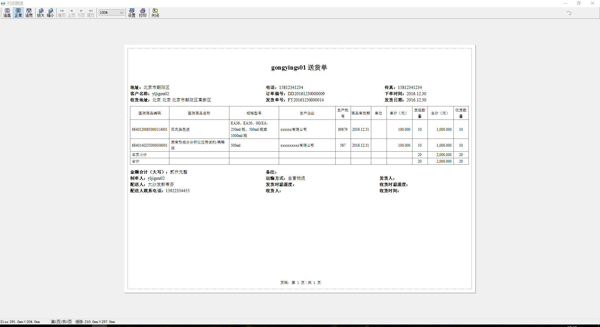

### 相关资源

+ 官网下载中心（程序+文档）：[http://www.lodop.net/download.html](http://www.lodop.net/download.html)
+ 官方打印示例：[http://www.lodop.net/demo.html](http://www.lodop.net/demo.html)
+ 常见问题列表：[http://www.lodop.net/problem.html](http://www.lodop.net/problem.html)

### 一个发运单打印的 Demo

+ demo 结构

> 其中使用 layui 处理弹窗；data.json 是模拟数据

```
.
├── assets
│   ├── images
│   │   ├── layer-btn-cancel-hover.png
│   │   ├── layer-btn-cancel.png
│   │   ├── layer-btn-ok-hover.png
│   │   ├── layer-btn-ok.png
│   │   ├── layui-layer-title-close-hover.png
│   │   ├── layui-layer-title-close.png
│   │   └── layui-layer-title-info.png
│   ├── jquery.min.js
│   ├── jquery.tmpl.js
│   ├── layer
│   │   ├── extend
│   │   │   └── layer.ext.js
│   │   ├── layer.js
│   │   └── skin
│   │       ├── default
│   │       │   ├── icon-ext.png
│   │       │   ├── icon.png
│   │       │   ├── loading-0.gif
│   │       │   ├── loading-1.gif
│   │       │   └── loading-2.gif
│   │       ├── layer.css
│   │       └── layer.ext.css
│   ├── lodop
│   │   ├── CLodop_Setup_for_Win32NT.exe
│   │   ├── LodopFuncs.js
│   │   ├── install_lodop32.exe
│   │   └── install_lodop64.exe
│   └── my.js
├── data.json
└── index.html
```


+ 预览效果如下


